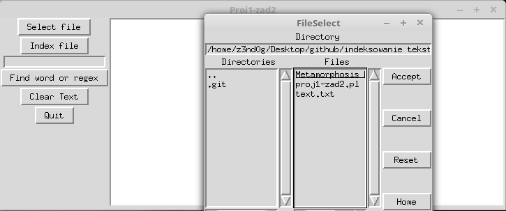

# indeksowanie-tekstow

Po uruchomieniu należy wybrać plik, który następnie można zindeksować lub przeszukać wpisując szukane słowo albo wyrażenie regularne. Indeks przechowywany jest w hashu %index powiązanym z plikiem index.dbm, który zapisuje się na dysku.

